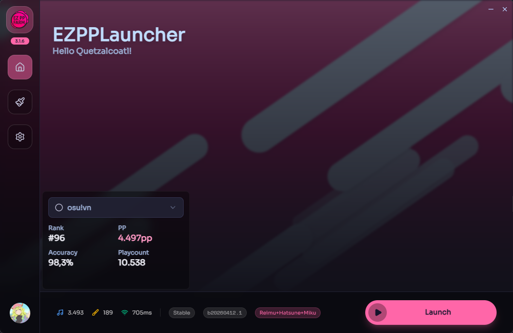

# EZPPLauncher

**EZPPLauncher** is a custom launcher for the private osu! server [EZPPFarm](https://ez-pp.farm), built with **Rust** and **Svelte** using the [Tauri](https://tauri.app) framework.  
It enhances the osu! experience with quality-of-life features and integration specifically designed for the EZPPFarm community.

---

## 🖼️ Preview



---

## 🚀 Features

- [x] Automatically updates osu! before launching
- [x] Automatic ingame login
- [x] Patches the osu! client to show misses in Relax and Autopilot
- [x] Displays your EZPPFarm stats in the launcher
- [x] Shows the number of imported beatmapsets
- [x] Shows the number of imported skins
- [x] Displays ping to the EZPPFarm server
- [x] Discord Rich Presence
- [x] Performance Display Overlay (currently in experimental patcher release stream)

---

## 💻 Supported Platforms

| Platform | Status                                   |
| -------- | ---------------------------------------- |
| Windows  | ✅ Supported                             |
| macOS    | ❌ Not supported                         |
| Linux    | 🕧 Partially supported (via osu-winello) |

> Currently, only **Windows** is fully supported. Support for other platforms may be considered in the future.

---

## 🛠 Build From Source

### Requirements

- **Rust** (installed via [rustup](https://rustup.rs/) – recommended for Windows)
- **Cargo** (comes with rustup)
- **[Bun](https://bun.sh/)** (JavaScript runtime)

### Steps

```bash
# Install all dependencies
bun i

# Build the project
bun run build
```

After building, the launcher executable will be located at:

```
src-tauri/target/release/ezpplauncher.exe
```

---

## 📁 Project Structure (Simplified)

```
├── src/                    # Frontend (Svelte)
├── src-tauri/              # Backend (Rust)
│   ├── tauri.conf.json     # Tauri configuration
├── package.json            # Bun project config
└── README.md
```
